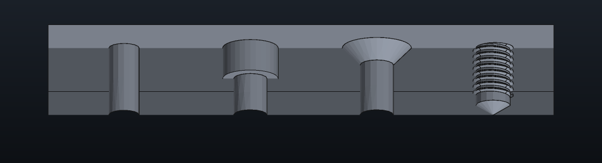

# Holes

Design's Hole (Shift+H, with a sketch selected on a body that has a
solid) drills at every circle centre and lone point of the sketch,
construction geometry left out. It starts as a custom 5 mm hole, 10 mm
deep, drilled against the sketch's normal; **Reversed** drills the other
way. The task panel sets the rows below; a script sets the same fields
by name (`pc.design.hole`, `pc.design.set`).



## Size

**Standard** is Custom (a plain diameter) or a thread standard:

| Standard | Sizes | Form |
| --- | --- | --- |
| ISO metric coarse, fine | M1.6 to M48, M3x0.35 to M36x3 | 60° |
| UNC, UNF, UNEF | #0 to 1 inch | 60° |
| BSW, BSF | 1/8 to 1 inch | 55° |
| BSP parallel (G) | 1/16 to 2 | 55° |
| BSP taper (Rc) | 1/16 to 2 | 55°, 1:16 taper |
| NPT | 1/16 to 2 | 60°, 1:16 taper |

A sized hole drills the tap drill when **Threaded (tap drill)** is on,
otherwise the clearance of its **Fit** (close, normal, loose: ISO 273 for
metric sizes, ASME B18.2.8 for unified ones; the other standards drill
the major diameter), or **Custom**, a clearance diameter of your own. A
tapped taper thread drills the thread's minor diameter at the face and
narrows 1:16 on the diameter from there.

**Class** is the internal thread's class: 4H to 8H and 4G to 8G for metric
(a G class moves the diameters out by the ISO 965-1 allowance,
(15 + 11 P) µm), 1B to 3B for unified, Medium or Normal for Whitworth. Pipe
threads have none. **Left-hand thread** turns a modeled thread the other
way.

**Modeled thread** (offered once Threaded is on) cuts the thread itself
into the wall, for printing it rather than tapping it: the standard's
flank angle, out to its major diameter, along a cone for a taper thread.
**Thread length** is **Depth given** (the **Thread depth** row), the
**Whole hole**, or the hole **Less the run-out** of three pitches a tap
leaves at the bottom. A through hole's thread needs the solid built
first, to know how far it runs.

## Depth and bottom

**Through all** or a **Depth**. A blind hole's **Drill point** is flat or
angled (118°, 135° or any **Point angle** from 10° to 170°); **Point
within the depth** makes the depth run to the tip rather than to the end
of the wall.
**Taper** leans the wall in toward the bottom, up to 44° either way (a
tapped taper thread uses its own).

## Hole cut

- **Counterbore:** a wider bore, diameter and depth.
- **Spotface:** a shallow counterbore, to face a seat.
- **Countersink:** a cone, diameter at the face and included angle.
- **Counterdrill:** a wider bore ending in a cone down to the hole:
  diameter, depth and the cone's angle.

The seats below are offered only for a hole sized from an ISO metric
thread, and a size the seat's table lacks says so in the panel.

- **ISO 4762 seat:** the counterbore for a socket head cap screw of the
  hole's metric size (DIN 974-1 diameters).
- **ISO 10642 seat:** the 90° countersink for a countersunk socket screw of
  the hole's metric size.
- **ISO 7380 seat:** the counterbore for a button head screw.
- **ISO 2009 seat** and **ISO 7046 seat:** the 90° countersink for a
  slotted or cross recessed countersunk screw.
- **DIN 7984 seat:** the counterbore for a low head cap screw.
- **ISO 4762 + washer seat:** the counterbore for a socket head cap screw
  on an ISO 7089 washer (DIN 974-1's wider row).
- **ISO 4017 seat:** the counterbore for a hex head screw, with room for a
  socket wrench (DIN 974-2).

## Nut trap

**Nut trap** cuts a hexagonal pocket at one end of the hole that holds a
nut captive, beside any hole cut. It is sized from the nut of the hole's
ISO metric thread; [PRINTING.md](PRINTING.md#nut-traps) has the sizes,
the clearance, the depth and the side it sits on. A hole sized otherwise
takes a nut trap of its own size.

## Your own cuts

Cuts you use often go in `hole_cuts.json` in the application's
configuration folder (`~/.config/printcad/` on Linux, beside
`settings.json`). It is read once a run, the first time a hole lists its
cuts; its profiles are listed under the standard cuts, and picking one
copies its sizes into the hole. Screw seats and `None` are left out of it,
since a seat needs the hole's size.

```json
{
  "profiles": [
    { "name": "M3 heat insert", "cut": { "Counterbore": { "diameter": 4.2, "depth": 5.0 } } },
    { "name": "Deburr 6", "cut": { "Countersink": { "diameter": 6.0, "angle_deg": 90.0 } } },
    { "name": "Stepped 8", "cut": { "Counterdrill": { "diameter": 8.0, "depth": 3.0, "angle_deg": 118.0 } } },
    { "name": "Face 12", "cut": { "Spotface": { "diameter": 12.0, "depth": 0.5 } } }
  ]
}
```

## Scripts

```lua
pc.design.hole{
  sketch = s,
  depth = 8,
  thread = {standard = "Unc", size = "1/4-20", class = "3B", left_handed = false},
  threaded = true,
  drill_point = {Angled = {angle_deg = 118}},
  cut = {Counterdrill = {diameter = 9, depth = 2, angle_deg = 90}},
}
```

`standard` is one of `IsoMetricCoarse`, `IsoMetricFine`, `Unc`, `Unf`,
`Unef`, `Bsw`, `Bsf`, `BspParallel`, `BspTaper` or `Npt`; `size` is the
designation the panel lists. A size alone, `thread = "M6"` or
`thread = "1/4-20"`, takes the first standard that has it. A drill point is
`drill_point = {Angled = {angle_deg = 135}}`, or `{Angled = {}}` for 118°. A screw seat is `cut = {Seat = {seat =
"SocketHead"}}`, or `"Countersunk"`, `"ButtonHead"`, `"SlottedCountersunk"`,
`"CrossCountersunk"`, `"LowHeadCap"`, `"CapScrewWithWasher"`, `"HexHead"`.
`clearance` sets a clearance of your own; `thread_length` is `"Given"`,
`"HoleDepth"` or `"RunOut"`. `nut_trap = true` adds a nut trap at the
mouth; a table sets it: `nut_trap = {side = "Bottom", clearance = 0.4,
depth = 3, across_flats = 7, turn_deg = 30, standard = "Din934"}`, each
field left out taking its usual value.

## Holes already in a solid

**Recognize holes** (`pc.design.recognize_holes`) turns the round bores
of a body's solid, imported ones included, into Hole features: their
faces go in one Delete faces feature, and each set of alike holes on one
plane is drilled again from a hidden sketch of their centres. Bores it
cannot describe (counterbores, countersinks, slots) stay as they are.
