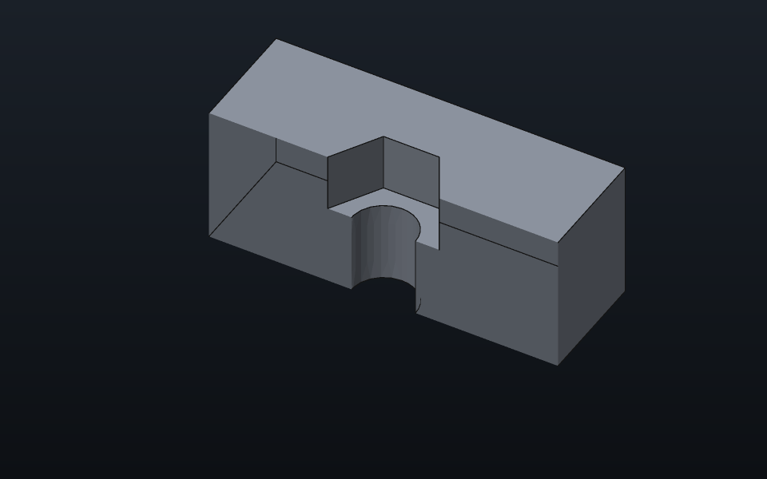
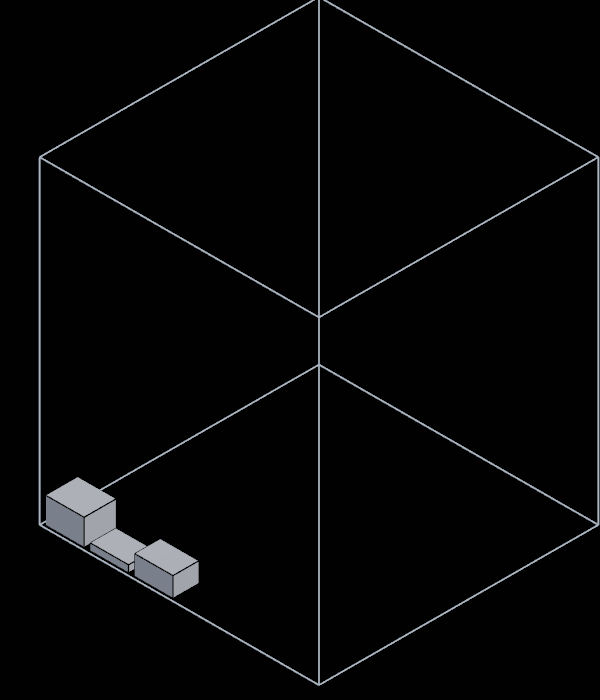
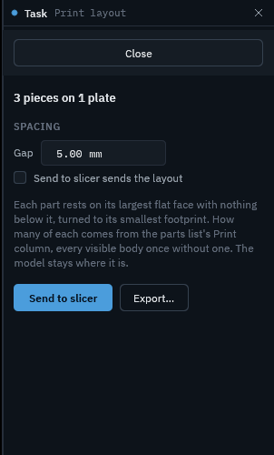

# Printing

What printCAD offers for the step from a model to a printer: the parts
list's printing columns, nut traps for captive nuts, and the print
layout that lays every part flat on the bed for export or the slicer.
The bed itself (its size, where its origin is, whether it is drawn) and
the slicer command are set in Preferences › Printing.

## Printing columns

The Assembly's Parts list (B) carries three columns for printing beside
the count and size of each part:

- **Print**: how many of the part to print. It starts at one per body of
  the part (a part that is bought starts at none); type another count in
  the cell to print spares or fewer. Clearing the cell goes back to one
  per body. The count is the whole part's, however the list is grouped.
- **Volume**: the volume of one piece. A solid's is the kernel's exact
  measure, worked out away from the window and kept until the part's
  shape changes (the cell shows … meanwhile); a mesh body's is the
  volume its triangles enclose.
- **Mass**: the filament one piece takes, its volume at the density of
  the material it is printed in.

**Printed in** under the list picks the material: PLA (1.24 g/cm³), PETG
(1.27), ABS (1.04), ASA (1.07), TPU (1.21), Nylon (1.14) or PC (1.20), or
Custom with a density of your own. It is kept with the document. A body
given a material of its own (Appearance, or `doc.set_body`) is weighed at
that material's density instead.

The line under the list adds it up: how many pieces, their volume and the
filament they take. Copy as CSV and Save as CSV carry the Print, Volume
(cm³) and Mass (g) columns too.

From a script, `asm.parts` answers `print`, `volume`, `mass` and
`density` for each part, `asm.part{body = ..., print = 3}` sets a count
and `asm.print_material{name = "PETG"}` the material (a name of your own
needs its `density`).

## Nut traps

A Hole's **Nut trap** (in the Hole task, under the hole cut) cuts a
hexagonal pocket at one end of the hole for a nut to sit in captive, so
a screw turns into it from the other side.

- **Nut**: the standard the pocket is sized from, by the hole's ISO
  metric thread size: ISO 4032 (the usual hex nut) or DIN 934 (17, 19 and
  22 mm across the flats for M10, M12 and M14 where ISO 4032 has 16, 18
  and 21). **Own size** takes an across-flats of your own instead, for
  any hole, a thread of another standard included.
- **Nut clearance**: added to the nut's across-flats and to its
  thickness, 0.3 mm unless set, so the nut drops in. Printers that print
  holes small want more.
- **Own depth**: a pocket deeper or shallower than the nut and its
  clearance.
- **Nut side**: Top puts the pocket at the hole's mouth, on its sketch's
  plane. Bottom puts it where the hole ends, its floor at the hole's
  depth: a nut buried in the part, set in by pausing the print at the
  layer above the pocket. A hole through all has no end to measure from,
  so a pocket at its bottom asks for the hole's depth instead; to trap a
  nut on the far face of a plate, give the hole the plate's thickness as
  its depth.
- **Nut turn**: the hexagon turned about the hole's axis; at 0 a corner
  points along the sketch's X. Turn it 30° to lay a flat along X, which
  prints a cleaner pocket roof when the hole lies on its side.

The panel says what the pocket comes to, or why it cannot be cut (no
metric size, a pocket no wider than the hole, one deeper than the hole).
A nut trap's clearance, depth, across-flats and turn take formulas
(`Hole.nut_clearance`, `Hole.nut_depth`, `Hole.nut_across_flats`,
`Hole.nut_turn`).

ISO 4032 across flats and thickness, mm:

| Size | M2 | M2.5 | M3 | M4 | M5 | M6 | M8 | M10 | M12 | M16 | M20 |
|------|----|------|----|----|----|----|----|-----|-----|-----|-----|
| Across flats | 4 | 5 | 5.5 | 7 | 8 | 10 | 13 | 16 | 18 | 24 | 30 |
| Thickness | 1.6 | 2 | 2.4 | 3.2 | 4.7 | 5.2 | 6.8 | 8.4 | 10.8 | 14.8 | 18 |

From a script, `nut_trap` is a field of `design.hole`: `nut_trap = true`
for the usual pocket at the mouth, or a table, `{side = "Bottom",
clearance = 0.4, depth = 3, across_flats = 7, turn_deg = 30, standard =
"Din934"}`, each field left out taking its usual value.

## Print layout

File › Print layout… (also in the command palette) lays every part to
print on the bed, as many copies as the parts list's Print column asks
for, and shows them there in the view while its task is open. Nothing
moves: the model is back where it was when the task closes, and the
layout is only where export and the slicer put the copies.

- **Which parts, how many**: each part of the parts list with a count to
  print above none and at least one visible body. A document whose
  benches keep no parts list prints every visible body that is not
  bought, once.
- **How a part lies**: on its largest flat face that the whole part
  stands on, no point of it below that face's plane; among faces within
  a hundredth of that area, the one leaving the part lowest. A part with
  no such face (a sphere) keeps the up of its own frame. It is then
  turned about the vertical to the smallest rectangle around its
  footprint, the rectangle's longer side along X.
- **How copies pack**: in rows along X, the deepest footprints first,
  each row as deep as its first copy, the **Gap** (5 mm unless set)
  between copies and half of it from the bed's edges. A copy that fits
  only turned a quarter goes turned. What one bed cannot hold starts
  another plate, drawn beside the first along X.
- **What does not fit**: a part wider or deeper than the bed goes on a
  plate of its own, and one taller than the build height is named too,
  as is a part not built yet, which is left out.

The bed is the one in Preferences › Printing (its width, depth, build
height and whether its origin is the centre).

The task's **Send to slicer** writes the layout in the slicer's format
and opens it in the slicer; **Export…** opens the export dialog set to
**Laid out for printing**, which the dialog offers at any time. **Send to
slicer sends the layout** (or Preferences › Printing › Send the print
layout) makes File › Send to slicer (Ctrl+P) send the layout always. With
several plates, the file holds them all, side by side.

From a script, `pc.doc.print_layout{}` answers where each copy goes
(its body, name, plate, bounds on the bed and the transform from the
body's own frame), with `bed = {x, y, z}` and `gap` to lay out for
another printer; `pc.file.export{path = ..., layout = true}` writes the
layout and `pc.file.send_to_slicer{layout = true}` sends it.
